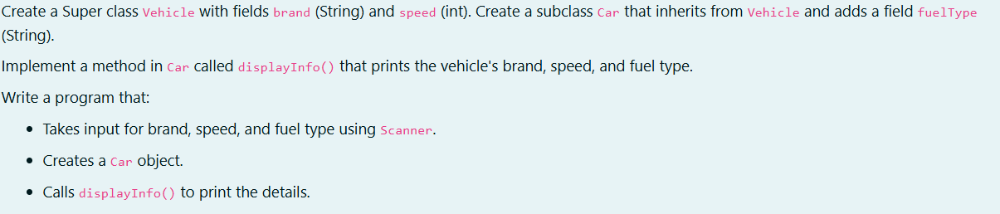
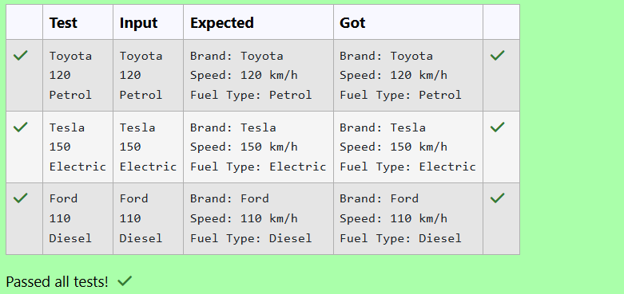

# Ex. No:3(A) INHERITANCE AND AGGREGATION

## QUESTION:



## AIM:

To create a superclass Vehicle with fields brand and speed, and a subclass Car that inherits from Vehicle and adds the field fuelType, then develop a Java program that takes user input using Scanner, creates a Car object, and displays the vehicle details using the displayInfo() method.

## ALGORITHM :
1. Start the program.

2. Create superclass Vehicle and subclass Car with displayInfo() method.

3. Read brand, speed, and fuelType using Scanner.

4. Create Car object and assign the input values.

5. Call displayInfo() to print details and stop the program.	


## PROGRAM:
 ```
Program to implement a Inheritance and Aggregation using Java
Developed by: DAKSHINA MOORTHY N D
RegisterNumber:  212224230049
```

## SOURCE CODE:

```java
import java.util.Scanner;
class Vehicle
{
    String brand;
    int speed;
    
}
class Car extends Vehicle
{
    String fuelType;
    void displayInfo()
    {
        System.out.println("Brand: "+brand);
        System.out.println("Speed: "+speed+" km/h");
        System.out.println("Fuel Type: "+fuelType);
    }
}
public class main
{
    public static void main(String args[])
    {
        Scanner sc = new Scanner(System.in);
        Car c1 = new Car();
        c1.brand = sc.nextLine();
        c1.speed = sc.nextInt();
        sc.nextLine();
        c1.fuelType = sc.nextLine();
        c1.displayInfo();
        
        
    }
}
```


## OUTPUT:



## RESULT:

Thus, the java program to create a superclass Vehicle with fields brand and speed, and a subclass Car that inherits from Vehicle and adds the field fuelType, then develop a Java program that takes user input using Scanner, creates a Car object, and displays the vehicle details using the displayInfo() method has been executed successfully.

