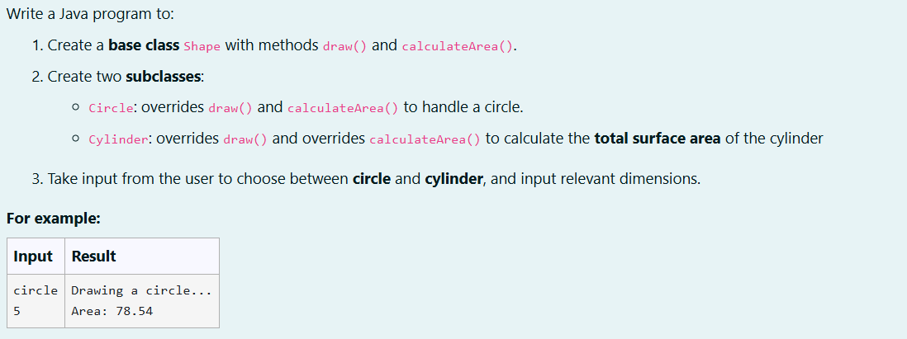
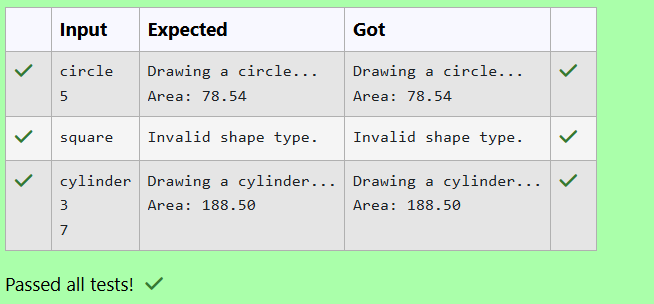

# Ex. No:3(b) POLYMORPHISM

## QUESTION:



## AIM:

To develop a Java program that demonstrates method overriding using inheritance by creating a base class Shape with methods draw() and calculateArea(), and implementing subclasses Circle and Cylinder that override these methods to perform shape-specific drawing and area calculations based on user input.

## ALGORITHM :
1. Start the program and define base class Shape with methods draw() and calculateArea(), and subclasses Circle and Cylinder that override these methods.

2. Read the shape type from the user using Scanner.

3. If the type is circle, read the radius and create a Circle object.

4. If the type is cylinder, read the radius and height and create a Cylinder object.

5. Call draw() and calculateArea() to display the shape and its area, then end the program.


## PROGRAM:
 ```
Program to implement a Polymorphism using Java
Developed by: DAKSHINA MOORTHY N D
RegisterNumber:  212224230049
```

## SOURCE CODE:

```java
import java.util.Scanner;
class Shape
{
    void draw()
    {
        System.out.println("Drawing shape...");
    }
    void calculateArea()
    {
        System.out.println("Calculating area...");
    }
    
}
class Circle extends Shape
{
    double n;
    Circle(double n)
    {
        this.n = n;
    }
    @Override
    void draw()
    {
        System.out.println("Drawing a circle...");
    }
    
    @Override
    void calculateArea()
    {
        System.out.printf("Area: %.2f",(Math.PI * n * n ));
    }
}
class Cylinder extends Shape
{
    double r,h;
    Cylinder (double r, double h)
    {
        this.r = r;
        this.h = h;
    }
    @Override
    void draw()
    {
        System.out.println("Drawing a cylinder...");
    }
    
    @Override
    void calculateArea()
    {
        System.out.printf("Area: %.2f",( 2.0 * Math.PI * r* (r+h)));
    }
}
public class main
{
    public static void main(String args[])
    {
        Scanner sc = new Scanner(System.in);
        String type = sc.nextLine();
        if (type.equalsIgnoreCase("circle"))
        {
            double r = sc.nextDouble();
            Circle c1 = new Circle(r);
            
            c1.draw();
            c1.calculateArea();
        }
        else if (type.equalsIgnoreCase("cylinder"))
        {
            double r = sc.nextDouble();
            double h = sc.nextDouble();
            Cylinder c2 = new Cylinder(r,h);
            c2.draw();
            c2.calculateArea();
            
        }
        else
        {
            System.out.println("Invalid shape type.");
        }
    }
}
```


## OUTPUT:



## RESULT:

Thus, the Java program that demonstrates method overriding using inheritance by creating a base class Shape with methods draw() and calculateArea(), and implementing subclasses Circle and Cylinder that override these methods to perform shape-specific drawing and area calculations based on user input has been executed successfully.

