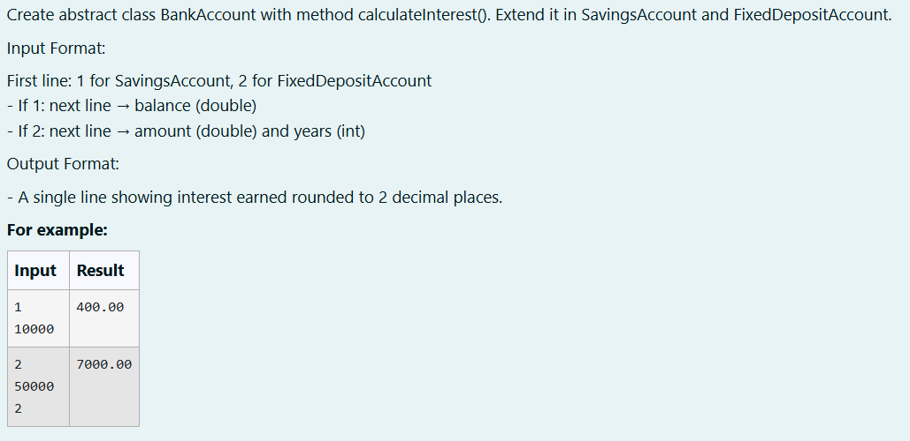
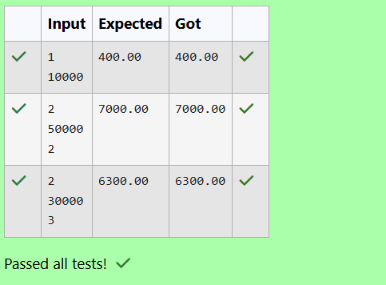

# Ex. No:3(C) ABSTRACTION

## QUESTION:





## AIM:

To develop a Java program using abstraction by creating an abstract class BankAccount with an abstract method calculateInterest(), and implementing subclasses SavingsAccount and FixedDepositAccount that calculate interest based on user input.

## ALGORITHM :
1. Start the program and create an abstract class BankAccount with an abstract method calculateInterest().

2. Create subclasses SavingsAccount and FDA (FixedDepositAccount) that extend BankAccount and override calculateInterest().

3. Read the account type from the user using Scanner.

4. If the type is 1, read the balance, create a SavingsAccount object, and calculate interest; if the type is 2, read amount and years, create an FDA object, and calculate interest.

5. Display the interest earned rounded to two decimal places and end the program.


## PROGRAM:
 ```

Program to implement a Abstraction using Java
Developed by: DAKSHINA MOORTHY N D
RegisterNumber:  212224230049
```

## SOURCE CODE:

```java
import java.util.Scanner;
abstract class BankAccount
{
    abstract void calculateInterest();
}
class SavingsAccount extends BankAccount
{
    double balance;
    SavingsAccount(double balance)
    {
        this.balance = balance;
    }
    @Override
    void calculateInterest()
    {
        System.out.printf("%.2f",(balance * 0.04));
    }
}
class FDA extends BankAccount
{
    double amt;
    int years;
    FDA(double amt, int years)
    {
        this.amt = amt;
        this.years = years;
    }
    @Override
    void calculateInterest()
    {
        System.out.printf("%.2f",(amt * 0.07 * years));
    }
}
public class main
{
    public static void main(String args[])
    {
        Scanner sc = new Scanner(System.in);
        int type = sc.nextInt();
        if (type == 1)
        {
            double balance = sc.nextDouble();
            SavingsAccount s1 = new SavingsAccount(balance);
            s1.calculateInterest();
        }
        else if (type == 2)
        {
            double amt = sc.nextDouble();
            int years = sc.nextInt();
            FDA f1 = new FDA(amt,years);
            f1.calculateInterest();
        }
    }
}

```


## OUTPUT:



## RESULT:

Thus, the Java program using abstraction by creating an abstract class BankAccount with an abstract method calculateInterest(), and implementing subclasses SavingsAccount and FixedDepositAccount that calculate interest based on user input has been executed successfully.

