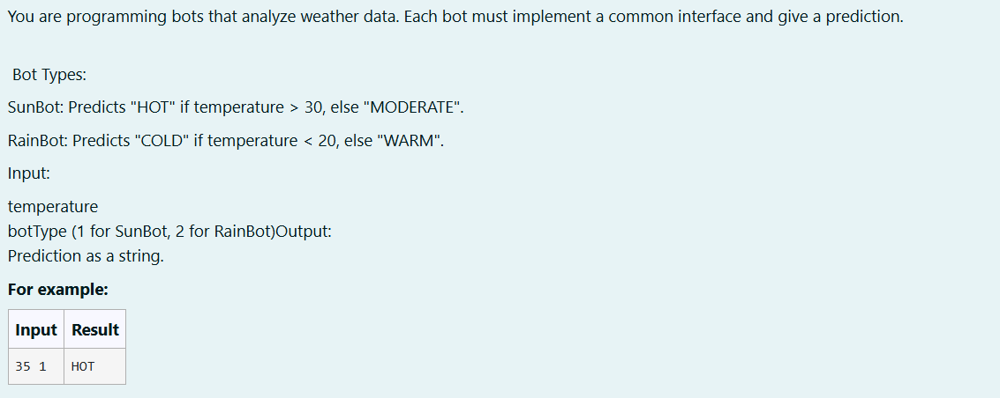
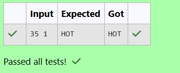

# Ex. No:3(D)    INTERFACE 

## QUESTION:


## AIM:

Aim:
To develop a Java program using an interface where different weather analysis bots (SunBot and RainBot) implement a common method to predict weather conditions based on the given temperature and selected bot type.

## ALGORITHM :
1. Start the program and create an interface WeatherBot with the method predict(int temp).

2. Implement the interface in two classes SunBot and RainBot, each providing its own prediction logic.

3. Read the temperature and bot type from the user using Scanner.

4. If the bot type is 1, create a SunBot object; if it is 2, create a RainBot object.

5. Call the predict() method, print the prediction result, and end the program.


## PROGRAM:
 ```
Program to implement a Interface using Java
Developed by: DAKSHINA MOORTHY N D
RegisterNumber: 212224230049
```

## SOURCE CODE:


```java
import java.util.Scanner;
interface WeatherBot
{
    String predict(int temp);
}
class SunBot implements WeatherBot
{
    public String predict(int temp)
    {
        return temp > 30 ? "HOT" : "MODERATE";
    }
}
class RainBot implements WeatherBot
{
    public String predict(int temp)
    {
        return temp < 20 ? "COLD" : "WARM";
    }
}
public class main
{
    public static void main(String args[])
    {
        Scanner sc = new Scanner(System.in);
        int temp = sc.nextInt();
        int type = sc.nextInt();
        if (type==1)
        {
            SunBot s1 = new SunBot();
            String res = s1.predict(temp);
            System.out.println(res);
        }
        else if(type == 2)
        {
            RainBot r1 = new RainBot();
            String res = r1.predict(temp);
            System.out.println(res);
        }
    }
}
```


## OUTPUT:



## RESULT:


Thus, the java program using an interface where different weather analysis bots (SunBot and RainBot) implement a common method to predict weather conditions based on the given temperature and selected bot type has been executed successfully.