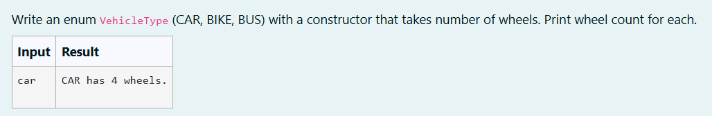
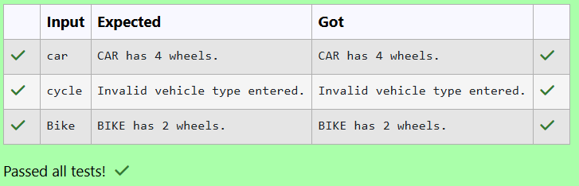

# Ex. No:3(E) INNER CLASS

## QUESTION:



## AIM:

To create a Java program using an enum VehicleType with constants CAR, BIKE, and BUS, each initialized through a constructor with the number of wheels, and display the wheel count for the selected vehicle type.

## ALGORITHM :
1. Start the program and define an enum VehicleType with constants CAR, BIKE, and BUS.

2. Read the vehicle type input from the user using Scanner and convert it to uppercase.

3. Convert the input string into the corresponding enum value using VehicleType.valueOf().

4. Use a switch statement to check the vehicle type and print the corresponding number of wheels.

5. If the input is invalid, display an error message and end the program.


## PROGRAM:
 ```
Program to implement a Inner Class using Java
Developed by: DAKSHINA MOORTHY N D
RegisterNumber: 212224230049
```

## SOURCE CODE:


```java
import java.util.Scanner;
enum VehicleType {CAR, BIKE, BUS};
public class main
{
    public static void main(String args[])
    {
        Scanner sc = new Scanner(System.in);
        String input = sc.next().toUpperCase();
        try
        {
        VehicleType v = VehicleType.valueOf(input);
        
        
        switch(v)
        {
            case CAR:
                System.out.println("CAR has 4 wheels.");
                break;
                
            case BIKE:
                System.out.println("BIKE has 2 wheels.");
                break;
                
            case BUS:
                System.out.println("BUS has 6 wheels.");
                break;
                
            default:
                System.out.println("Invalid vehicle type entered.");
                break;
        }
        }
        catch (IllegalArgumentException e)
        {
            System.out.println("Invalid vehicle type entered."); 
        }
        
    }
}
```


## OUTPUT:



## RESULT:

Thus, the Java program using an enum VehicleType with constants CAR, BIKE, and BUS, each initialized through a constructor with the number of wheels, and display the wheel count for the selected vehicle type has been executed successfully.

