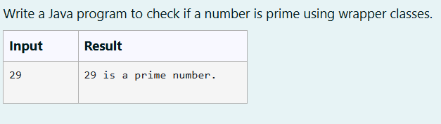
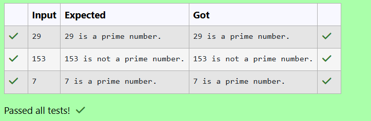

# Ex. No:3(F) WRAPPER CLASS

## QUESTION:



## AIM:

To write a Java program to check if a number is prime using wrapper classes. 

## ALGORITHM :
1. Start the program and read an integer num from the user using Scanner.

2. Initialize a boolean variable isPrime as true.

3. If num ≤ 1, set isPrime = false.

4. Otherwise, check divisibility from 2 to √num; if num % i == 0, set isPrime = false and stop the loop.

5. If isPrime is true print "num is a prime number", else print "num is not a prime number", then end the program.


## PROGRAM:
 ```
Program to implement a Wrapper Class using Java
Developed by: DAKSHINA MOORTHY N D
RegisterNumber: 212224230049
```

## SOURCE CODE:


```java
import java.util.*;

public class Main {
    public static void main(String[] args) {
        Scanner sc = new Scanner(System.in);

        Integer num = Integer.valueOf(sc.nextInt());
        boolean isPrime = true;

        if (num <= 1) {
            isPrime = false;
        } else {
            for (Integer i = 2; i <= Math.sqrt(num); i++) {
                if (num % i == 0) {
                    isPrime = false;
                    break;
                }
            }
        }

        if (isPrime) {
            System.out.println(num + " is a prime number.");
        } else {
            System.out.println(num + " is not a prime number.");
        }
    }
}
```


## OUTPUT:



## RESULT:

Thus, the java program to check if a number is prime using wrapper classes has been executed successfully.

