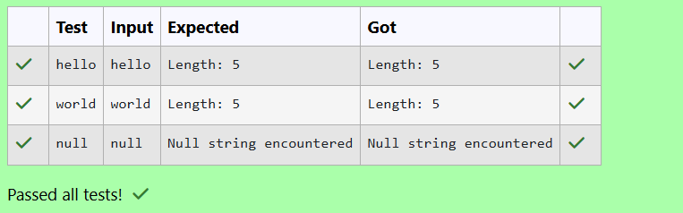

# Ex. No:4(A) EXCEPTION HANDLING

## QUESTION:


## AIM:

To identify and handle the NullPointerException that occurs when attempting to get the length of a null string, and ensure the program handles such situations gracefully.

## ALGORITHM :
1. Start the program.

2. Read a string input from the user using Scanner.

3. Check if the input equals "null" and assign the variable to null.

4. Try to find the length of the string using length() inside a try block.

5. If a NullPointerException occurs, catch it and print "Null string encountered", then end the program.


## PROGRAM:
 ```
Program to implement a Exception Handling using Java
Developed by: DAKSHINA MOORTHY N D
RegisterNumber:  212224230049
```

## SOURCE CODE:

```java
import java.util.Scanner;
public class main
{
    public static void main(String args[])
    {
        Scanner sc = new Scanner(System.in);
        String a = sc.nextLine();
        try
        {
            if (a.equals("null"))
            {
                a=null;
            }
            int len = a.length();
            System.out.println("Length: "+len);
        }
        catch (Exception e)
        {
            System.out.println("Null string encountered");
        }
    }
}
```


## OUTPUT:



## RESULT:


Thus, the java program to identify and handle the NullPointerException that occurs when attempting to get the length of a null string, and ensure the program handles such situations gracefully has been executed successfully.