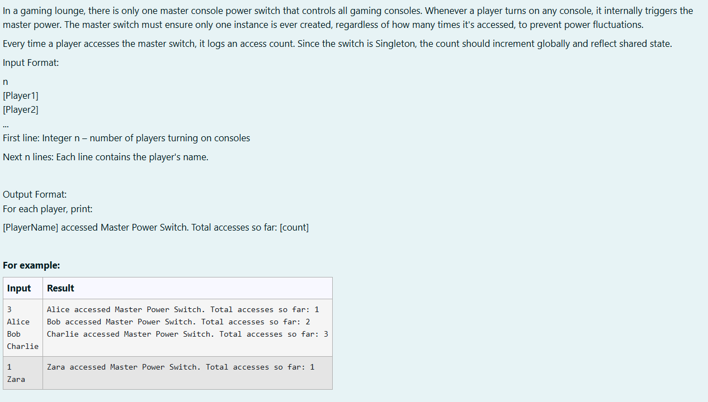
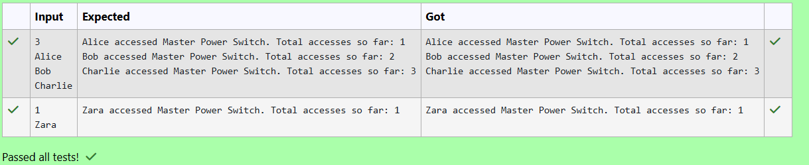

# Ex. No:4(B)  IMPLEMENT SOLID PRINCIPLES IN JAVA PROGRAM 

## QUESTION:



## AIM:

To implement the Singleton Design Pattern in Java to ensure that only one instance of the Master Power Switch is created and to track the total number of accesses by players globally.

## ALGORITHM :
1. Start the program and read the number of players n from the user using Scanner.

2. Create a Singleton class MasterPowerSwitch with:

    * A private static instance of the class.

    * A private constructor to prevent creating multiple objects.

    * A getInstance() method to return the single object.

3. Maintain a static variable accessCount in the Singleton class and create a method logAccess() to increment and return the access count.

4. Use a loop from 0 to n-1 to read each player's name and call MasterPowerSwitch.logAccess() to update the access count.

5. Display the output showing the player name and the total number of accesses to the Master Power Switch.


## PROGRAM:
 ```
Program to implement a SOLID Principles in Java Program
Developed by: DAKSHINA MOORTHY N D
RegisterNumber:  212224230049
```

## SOURCE CODE:

```java
import java.util.*;

class MasterPowerSwitch 
{

    private static MasterPowerSwitch instance;

    private static int accessCount = 0;

    private MasterPowerSwitch() { }

    public static MasterPowerSwitch getInstance() 
    {
        if (instance == null) 
        {
            instance = new MasterPowerSwitch();
        }
        return instance;
    }

    public static int logAccess() 
    {
        accessCount++;
        return accessCount;
    }
}


public class prog 
{
    public static void main(String[] args) 
    {
        Scanner sc = new Scanner(System.in);
        int n = sc.nextInt();
        sc.nextLine();

        for (int i = 0; i < n; i++) 
        {
            String player = sc.nextLine();
            
            int count = MasterPowerSwitch.logAccess();
            System.out.println(player + " accessed Master Power Switch. Total accesses so far: " + count);
        }
    }
}

```


## OUTPUT:



## RESULT:


Thus, the java program to implement the Singleton Design Pattern in Java to ensure that only one instance of the Master Power Switch is created and to track the total number of accesses by players globally has been implemented successfully.