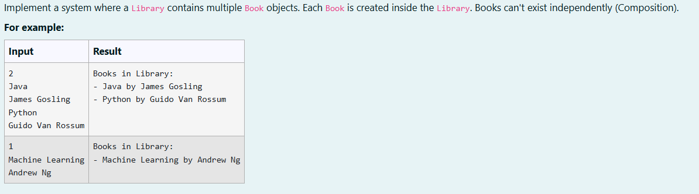
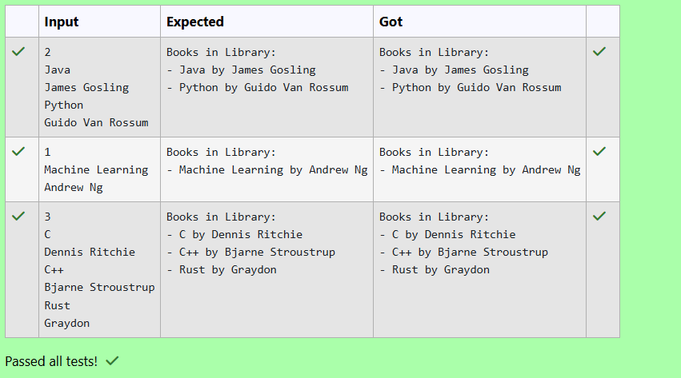

# Ex. No:4(C)  COMPOSITION IN JAVA

## QUESTION:



## AIM:

To implement Composition in Java by creating a system where a Library contains multiple Book objects, ensuring that Book objects cannot exist independently outside the Library.

## ALGORITHM :
1. Start the program and create a Library object. Read the number of books n from the user using Scanner.

2. Define a Book class with attributes title and author, and create a constructor to initialize these values.

3. Define a Library class that contains a List<Book> to store multiple book objects.

4. Use a loop from 0 to n-1 to read the title and author of each book and call the addBook() method, which creates a Book object inside the Library (Composition).

5. Display all books by calling showBooks() method, which prints the details of each book stored in the library.


## PROGRAM:
 ```
Program to implement a Composition Concepts in Java
Developed by: DAKSHINA MOORTHY N D
RegisterNumber:  212224230049
```

## SOURCE CODE:

```java
import java.util.*;

public class CompositionExample {
    public static void main(String[] args) {
        Scanner sc = new Scanner(System.in);
        Library library = new Library();

        int n = sc.nextInt();
        sc.nextLine();

        for (int i = 0; i < n; i++) {
            String title = sc.nextLine();
            String author = sc.nextLine();
            library.addBook(title, author);
        }

        library.showBooks();
        sc.close();
    }
}

class Book {
    private String title;
    private String author;

    public Book(String title, String author) {
        this.title = title;
        this.author = author;
    }

    public String getDetails() {
        return title + " by " + author;
    }
}

class Library {
    private List<Book> books = new ArrayList<>();

    public void addBook(String title, String author) {
        Book book = new Book(title, author);  // Book created inside Library (Composition)
        books.add(book);
    }

    public void showBooks() {
        System.out.println("Books in Library:");
        for (Book b : books) {
            System.out.println("- " + b.getDetails());
        }
    }
}
```


## OUTPUT:



## RESULT:

Thus, the java program to implement Composition in Java by creating a system where a Library contains multiple Book objects, ensuring that Book objects cannot exist independently outside the Library has been executed successfully.