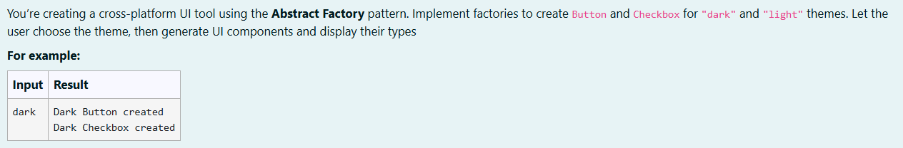
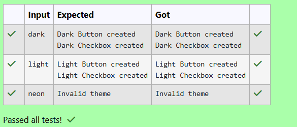

# Ex. No:4(D) DESIGN PATTERN -- ABSTRACT FACTORY

## QUESTION:



## AIM:

To implement the Abstract Factory Design Pattern in Java to create UI components (Button and Checkbox) for different themes (Dark and Light) and generate the appropriate components based on the user’s selected theme.

## ALGORITHM :
1. Start the program and read the theme choice (dark or light) from the user using Scanner.

2. Define interfaces Button and Checkbox with methods createButton() and createCheckbox().

3. Create concrete classes (DarkButton, DarkCheckbox, LightButton, LightCheckbox) that implement the respective interfaces and display messages when created.

4. Define the Abstract Factory interface UIFactory with methods createButton() and createCheckbox(), and implement it using DarkThemeFactory and LightThemeFactory.

5. Based on the user’s theme choice, instantiate the appropriate factory, create the Button and Checkbox objects, and display their creation messages.


## PROGRAM:
 ```
Program to implement a Abstract Factory Pattern using Java
Developed by: DAKSHINA MOORTHY N D
RegisterNumber:  212224230049
```

## SOURCE CODE:


```java
import java.util.*;

interface Button {
    void createButton();
}

interface Checkbox {
    void createCheckbox();
}

class DarkButton implements Button {
    public void createButton() {
        System.out.println("Dark Button created");
    }
}

class DarkCheckbox implements Checkbox {
    public void createCheckbox() {
        System.out.println("Dark Checkbox created");
    }
}

class LightButton implements Button {
    public void createButton() {
        System.out.println("Light Button created");
    }
}

class LightCheckbox implements Checkbox {
    public void createCheckbox() {
        System.out.println("Light Checkbox created");
    }
}

interface UIFactory {
    Button createButton();
    Checkbox createCheckbox();
}

class DarkThemeFactory implements UIFactory {
    public Button createButton() {
        return new DarkButton();
    }

    public Checkbox createCheckbox() {
        return new DarkCheckbox();
    }
}

class LightThemeFactory implements UIFactory {
    public Button createButton() {
        return new LightButton();
    }

    public Checkbox createCheckbox() {
        return new LightCheckbox();
    }
}

public class main {
    public static void main(String[] args) {
        Scanner sc = new Scanner(System.in);
        String theme = sc.nextLine();

        UIFactory factory;

        if (theme.equalsIgnoreCase("dark")) {
            factory = new DarkThemeFactory();
        } 
        else if (theme.equalsIgnoreCase("light")) {
            factory = new LightThemeFactory();
        } 
        else {
            System.out.println("Invalid theme");
            sc.close();
            return;
        }

        Button button = factory.createButton();
        Checkbox checkbox = factory.createCheckbox();

        button.createButton();
        checkbox.createCheckbox();

        sc.close();
    }
}
```


## OUTPUT:



## RESULT:

Thus, the java program to implement the Abstract Factory Design Pattern in Java to create UI components (Button and Checkbox) for different themes (Dark and Light) and generate the appropriate components based on the user’s selected theme has been implemented sucessfuly.