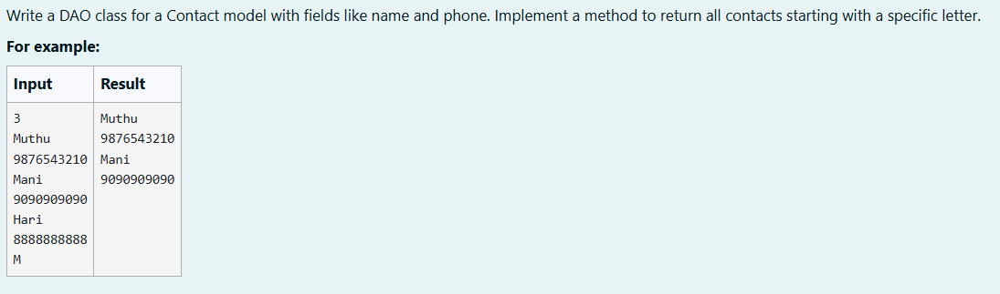
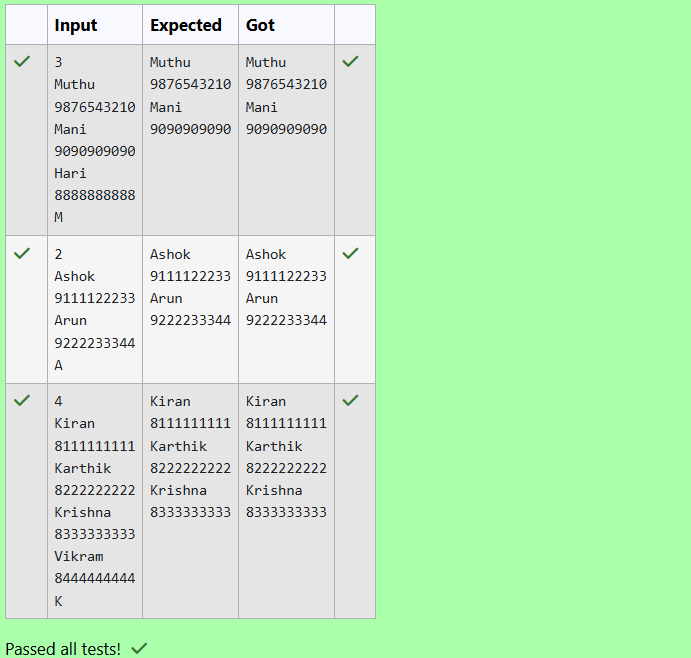

# Ex. No:4(D) DESIGN PATTERN  ---- BEHAVIOUR PATTERN

## QUESTION:



## AIM:

To write a DAO class for a Contact model with fields like name and phone and to implement a method to return all contacts starting with a specific letter.


## ALGORITHM :
1. Start the program and create a ContactDAO object using ContactDAOImpl. Read the number of contacts n from the user.

2. Create a Contact class with attributes name and phone, and use a constructor to initialize these values.

3. Store contacts in an ArrayList inside ContactDAOImpl and implement the addContact() method to add each contact to the list.

4. Read each contact’s name and phone number from the user in a loop and add them to the list using the addContact() method.

5. Read a character filter, retrieve contacts whose names start with that letter using getContactsStartingWith(), and display the filtered contact names and phone numbers.


## PROGRAM:
 ```
Program to implement a Behaviour Pattern using Java
Developed by: DAKSHINA MOORTHY N D
RegisterNumber:  212224230049
```

## SOURCE CODE:

```java
import java.util.*;

class Contact {
    private String name;
    private String phone;

    // Constructor
    public Contact(String name, String phone) {
        this.name = name;
        this.phone = phone;
    }

    // Getters
    public String getName() {
        return name;
    }

    public String getPhone() {
        return phone;
    }
}

interface ContactDAO {
    void addContact(Contact contact);
    List<Contact> getContactsStartingWith(char letter);
}

class ContactDAOImpl implements ContactDAO {
    // Use ArrayList to store contacts
    private List<Contact> contacts = new ArrayList<>();

    public void addContact(Contact contact) {
        contacts.add(contact);
    }

    public List<Contact> getContactsStartingWith(char letter) {
        List<Contact> result = new ArrayList<>();

        for (Contact c : contacts) {
            if (c.getName().charAt(0) == letter) {
                result.add(c);
            }
        }

        return result;
    }
}

public class ContactManager {
    public static void main(String[] args) {
        Scanner sc = new Scanner(System.in);
        ContactDAO dao = new ContactDAOImpl();

        // Read number of contacts
        int n = sc.nextInt();
        sc.nextLine();

        // Read name and phone
        for (int i = 0; i < n; i++) {
            String name = sc.nextLine();
            String phone = sc.nextLine();
            dao.addContact(new Contact(name, phone));
        }

        // Read character filter
        char letter = sc.nextLine().charAt(0);

        // Display filtered contacts
        List<Contact> filtered = dao.getContactsStartingWith(letter);

        for (Contact c : filtered) {
            System.out.println(c.getName());
            System.out.println(c.getPhone());
        }

        sc.close();
    }
}
```


## OUTPUT:



## RESULT:

Thus, the Java program to write a DAO class for a Contact model with fields like name and phone and to implement a method to return all contacts starting with a specific letter.