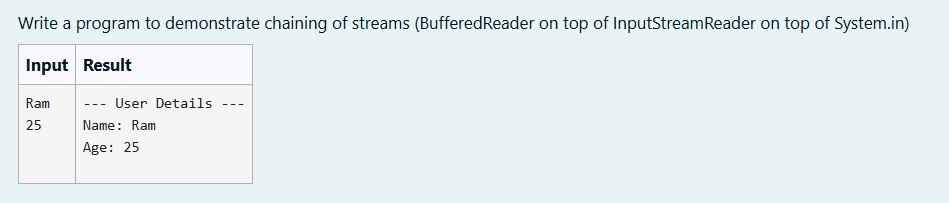
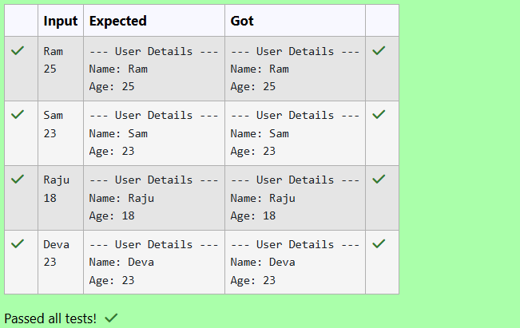

# Ex. No:5(A) INPUTSTREAMREADER 

## QUESTION:



## AIM:

To write a program to demonstrate chaining of streams (BufferedReader on top of InputStreamReader on top of System. in)


## ALGORITHM :
1. Start the program and create a BufferedReader object using InputStreamReader to read input from System. in.

2. Read the user's name from the keyboard using br.readLine() and store it in a variable name.

3. Read the user's age as a string using br.readLine() and convert it into an integer using Integer.parseInt().

4. Display a heading "--- User Details ---" on the screen.

5. Print the user's name and age using System.out.println() and end the program.


## PROGRAM:
 ```
Program to implement a InputStreamReader using Java
Developed by: DAKSHINA MOORTHY N D
RegisterNumber: 212224230049
```

## SOURCE CODE:

```java
import java.io.BufferedReader;
import java.io.IOException;
import java.io.InputStreamReader;

public class ChainingStreamsExample 
{
    public static void main(String[] args) throws IOException
    {
        BufferedReader br = new BufferedReader(new InputStreamReader(System.in));
        String name = br.readLine();
        int age = Integer.parseInt(br.readLine());
        
        System.out.println("--- User Details ---");
        System.out.println("Name: " + name);
        System.out.println("Age: " + age);
        
    }
}

```


## OUTPUT:



## RESULT:

Thus, the Java program to write a program to demonstrate chaining of streams (BufferedReader on top of InputStreamReader on top of System. in) has been executed successfully.
