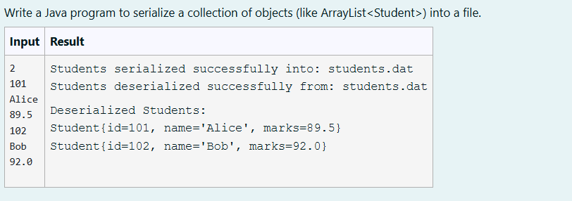
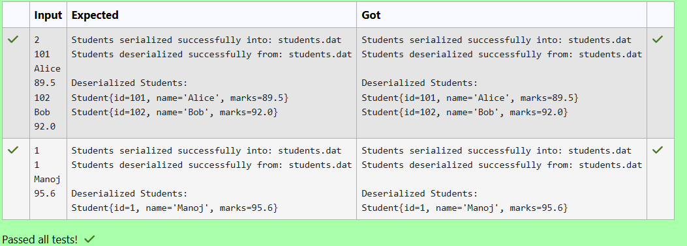

# Ex. No:5(B) SERIALIZATION AND DESERIALIZATION 

## QUESTION:



## AIM:

To write a Java program to serialize a collection of objects (like ArrayList<Student>) into a file.


## ALGORITHM :
1. Start the program and create a Scanner object. Read the number of students n from the user.

2. Create a Student class implementing Serializable with attributes id, name, and marks, and store the student objects in an ArrayList.

3. Read student details (id, name, marks) using a loop and add each Student object to the list.

4. Serialize the list of students by writing the ArrayList object to a file (students.dat) using ObjectOutputStream.

5. Deserialize the student list from the file using ObjectInputStream and display the student details on the screen.


## PROGRAM:
 ```
Program to implement a Serialization and Deserialization using Java
Developed by: DAKSHINA MOORTHY N D
RegisterNumber:  212224230049
```

## SOURCE CODE:

```java
import java.io.*;
import java.util.*;

// Student class must implement Serializable
class Student implements Serializable {
    private static final long serialVersionUID = 1L;

    private int id;
    private String name;
    private double marks;

    public Student(int id, String name, double marks) {
        this.id = id;
        this.name = name;
        this.marks = marks;
    }

    @Override
    public String toString() {
        return "Student{id=" + id + ", name='" + name + "', marks=" + marks + "}";
    }
}

public class StudentSerializationUserInput {

    // Serialize list of students
    public static void serializeStudents(List<Student> students, String fileName) {
        try (ObjectOutputStream oos = new ObjectOutputStream(new FileOutputStream(fileName))) {
            oos.writeObject(students);
            System.out.println("Students serialized successfully into: " + fileName);
        } catch (IOException e) {
            System.out.println("Error during serialization: " + e.getMessage());
        }
    }

    // Deserialize list of students
    @SuppressWarnings("unchecked")
    public static List<Student> deserializeStudents(String fileName) {
        List<Student> students = null;
        try (ObjectInputStream ois = new ObjectInputStream(new FileInputStream(fileName))) {
            students = (List<Student>) ois.readObject();
            System.out.println("Students deserialized successfully from: " + fileName);
        } catch (IOException | ClassNotFoundException e) {
            System.out.println("Error during deserialization: " + e.getMessage());
        }
        return students;
    }

    public static void main(String[] args) {

        Scanner scanner = new Scanner(System.in);
        List<Student> students = new ArrayList<>();

        int n = scanner.nextInt();
        scanner.nextLine(); // consume newline

        // Reading student details
        for (int i = 0; i < n; i++) {
            int id = scanner.nextInt();
            scanner.nextLine(); // consume newline
            String name = scanner.nextLine();
            double marks = scanner.nextDouble();
            scanner.nextLine(); // consume newline

            students.add(new Student(id, name, marks));
        }

        String fileName = "students.dat";

        // Serialize students
        serializeStudents(students, fileName);

        // Deserialize students
        List<Student> deserializedStudents = deserializeStudents(fileName);

        // Display deserialized data
        if (deserializedStudents != null) {
            System.out.println("\nDeserialized Students:");
            for (Student s : deserializedStudents) {
                System.out.println(s);
            }
        }

        scanner.close();
    }
}
```


## OUTPUT:



## RESULT:

Thus, the Java program to serialize a collection of objects (like ArrayList<Student>) into a file has been completed successfully.