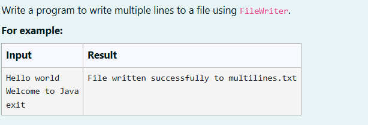
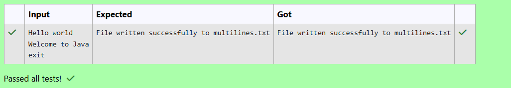

# Ex. No:5(C)  FILE HANDLING USING JAVA
## QUESTION:



## AIM:

To Write a program to write multiple lines to a file using FileWriter.


## ALGORITHM :
1. Start the program and create a Scanner object to read input from the user.

2. Create a FileWriter object to open the file "multilines.txt" for writing text.

3. Use an infinite loop to read lines of text from the user using nextLine().

4. Check if the input is "exit"; if it is, break the loop. Otherwise, write the text into the file followed by a newline.

5. Close the file and display a success message indicating that the file has been written successfully.


## PROGRAM:
 ```
Program to implement a File Handling using Java
Developed by: DAKSHINA MOORTHY N D
RegisterNumber:  212224230049
```

## SOURCE CODE:


```java
import java.util.Scanner;
import java.io.IOException;
import java.io.FileWriter;

public class main
{
    public static void main(String args[]) throws IOException
    {
        Scanner sc = new Scanner(System.in);
        try
        {
        FileWriter f = new FileWriter("multilines.txt");
        while (true)
        {
            String txt = sc.nextLine();
            if (txt.equalsIgnoreCase("exit"))
            {
                break;
            }
            f.write(txt+"\n");
            f.close();
            
        }
        System.out.println("File written successfully to multilines.txt");
        }
        catch (IOException e)
        {
                    System.out.println("File written successfully to multilines.txt");
 
        }
    }
}
```


## OUTPUT:



## RESULT:

Thus, the Java program o Write a program to write multiple lines to a file using FileWriter has been completed successfully.