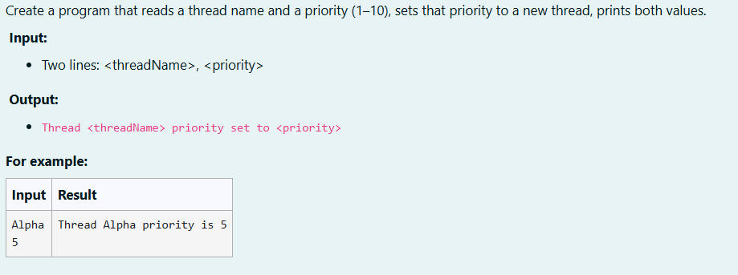
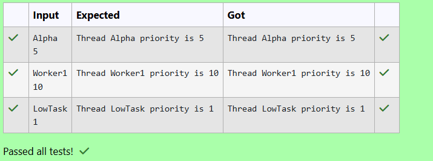

# Ex. No:5(D) THREAD PRIORITY

## QUESTION:



## AIM:

To Create a program that reads a thread name and a priority (1–10), sets that priority to a new thread, prints both values.


## ALGORITHM :
1. Start the program and create a Scanner object to read input from the user.

2. Read the thread name as a string and read the priority value as an integer from the user.

3. Create a new Thread object using the Thread class.

4. Set the thread name and priority using setName() and setPriority() methods.

5. Display the thread details by printing the thread name and its priority using getName() and getPriority().


## PROGRAM:
 ```
Program to implement a Thread Priority Concept using Java
Developed by: DAKSHINA MOORTHY N D
RegisterNumber:  212224230049
```

## SOURCE CODE:

```java
import java.util.Scanner;

public class Main {
    public static void main(String[] args) {
        Scanner sc = new Scanner(System.in);
        String name = sc.nextLine();
        int priority = sc.nextInt();

        Thread t = new Thread();
        t.setName(name);
        t.setPriority(priority);

        System.out.println("Thread " + t.getName() + " priority is " + t.getPriority());

        sc.close();
    }
}
```


## OUTPUT:



## RESULT:

Thus, the java program to Create a program that reads a thread name and a priority (1–10), sets that priority to a new thread, prints both values.