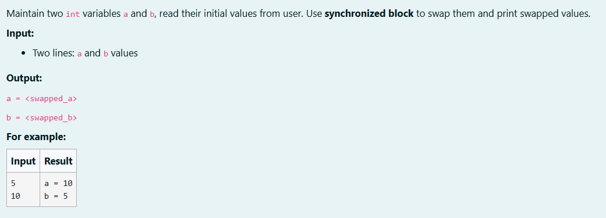

# Ex. No:5(E) MULTITHREADING -SYNCHRONIZATION

## QUESTION:



## AIM:

To write a Java program to implement synchronization in Java using a synchronized block to safely swap two integer variables a and b and display the swapped values.

## ALGORITHM :
1. Start the program and create a Scanner object to read input values a and b from the user.

2. Create a lock object that will be used for synchronization.

3. Enter a synchronized block using the lock object to ensure only one thread can execute the block at a time.

4. Swap the values of a and b using a temporary variable temp.

5. Print the swapped values of a and b and close the scanner.


## PROGRAM:
 ```
Program to implement a Synchronization concept using Java
Developed by: DAKSHINA MOORTHY N D
RegisterNumber: 212224230049
```

## SOURCE CODE:


```java
import java.util.Scanner;

public class Main {
    public static void main(String[] args) {
        Scanner sc = new Scanner(System.in);
        int a = sc.nextInt();
        int b = sc.nextInt();

        Object lock = new Object();

        synchronized (lock) {
            int temp = a;
            a = b;
            b = temp;
        }

        System.out.println("a = " + a);
        System.out.println("b = " + b);

        sc.close();

    }
}
```


## OUTPUT:


## RESULT:

Thus, the Java program to implement synchronization in Java using a synchronized block to safely swap two integer variables a and b and display the swapped values has been completed successfully.